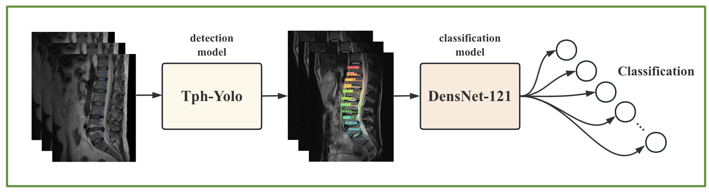
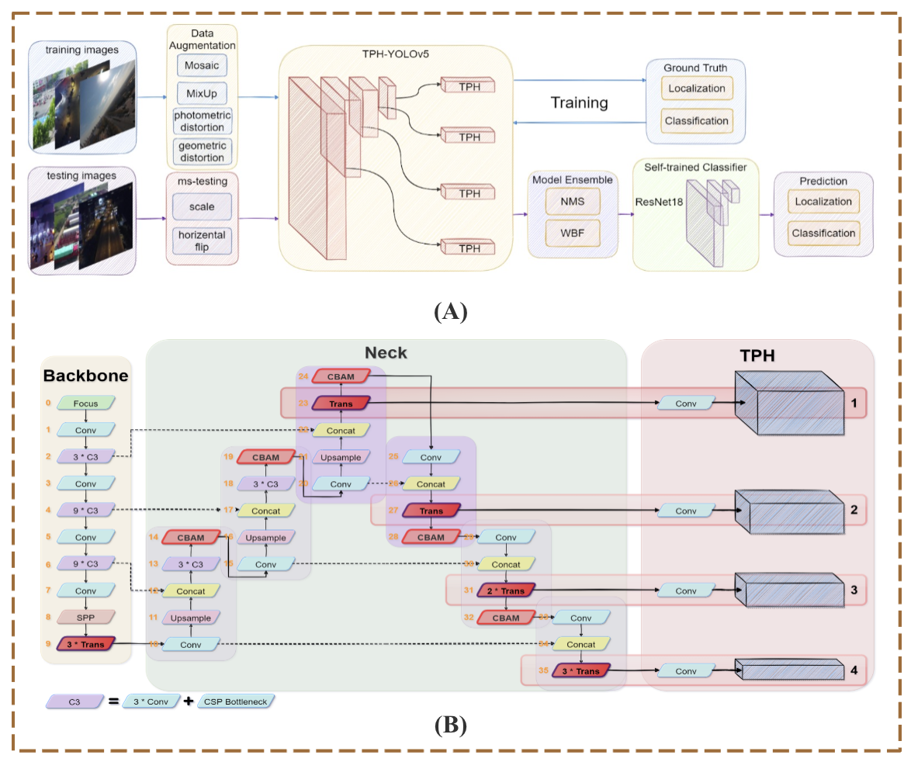
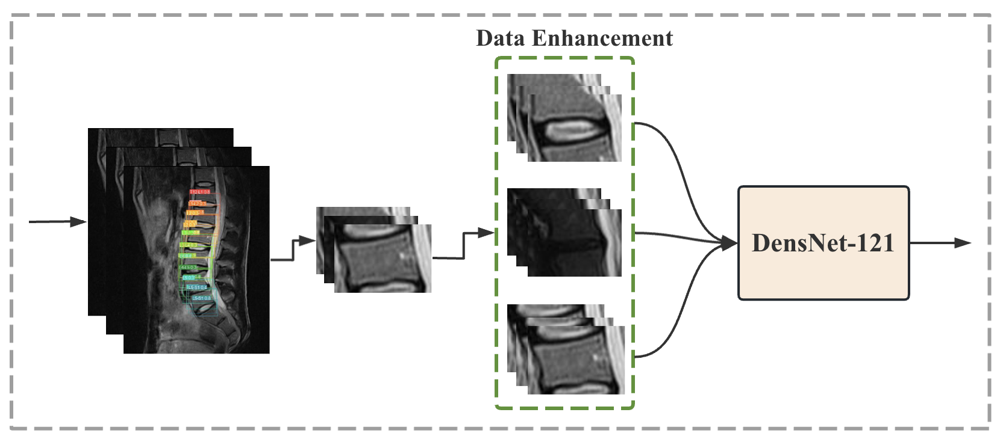
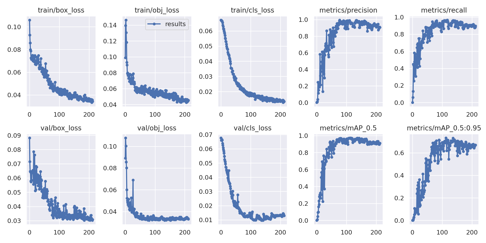
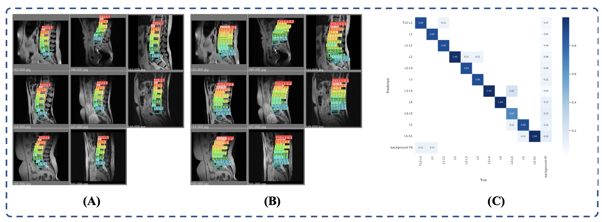
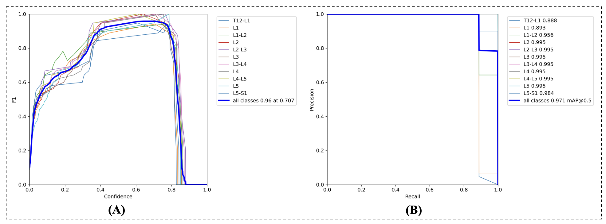

# 脊柱疾病智能诊断

<center><div style='height:2mm;'></div><div style="font-family:华文楷体;font-size:14pt;">欧阳家睿* 王子俊* 林佳盈* 俞沣城* 吕韦辰* 邓伟亮* 周德峰* 赵屾†</div></center>
<center><span style="font-family:华文楷体;font-size:9pt;line-height:9mm">*对本文章有同等贡献</span>
</center>
<div>
<div style="width:52px;float:left; font-family:方正公文黑体;">摘　要：</div> 
<div style="overflow:hidden; font-family:华文楷体;">基于深度学习的医学影像诊断是利用深度学习技术处理和分析医学影像数据，以辅助医生进行疾病的诊断和治疗决策。传统的医学影像诊断通常依赖于医生的经验和人工分析，但这种方法存在一些局限性，例如主观性、时间消耗和误诊率等。而基于深度学习的医学影像诊断通过训练深度神经网络来自动学习和识别影像中的病理特征，提供了一种全新的方法。本篇报告以脊柱疾病智能诊断问题为矢，对脊柱MRI影像进行数据增强处理，通过深度学习模型（ TPH-YOLO-v5 和 DenseNet-121 ）实现了锥体、椎间盘的检测，以及疾病诊断分类，并且获得了不错的效果。特别是我们TPH-YOLO-v5分割的准确率，可以达到86%。此外，本文还依据实验结果，对未来的深度学习辅助诊断技术的发展进行了一定的探讨。</div>
</div>
<div>
<div style="width:52px;float:left; font-family:方正公文黑体;">关键词：</div> 
<div style="overflow:hidden; font-family:华文楷体;">深度学习、医学影像诊断、数据增强、目标检测、图像分类</div>
</div>


# <center><strong><span style="font-family:Times New Roman;font-size:20pt;">Intelligent diagnosis of spinal diseases</span></strong></center>

<center><div style='height:2mm;'></div><div style="font-size:14pt;">Jiarui Ouyang*  Zijun Wang*  Jiaying Lin*  Fengcheng Yu*  Weichen Lv*  Weiliang Deng*  Defeng Zhou*  Shen Zhao†</div></center>
<center><span style="font-size:9pt;line-height:9mm"><i>*contribute equaly to this article</i></span>
</center>
<div>
<div style="width:82px;float:left;line-height:16pt"><b>Abstract: </b></div> 
<div style="overflow:hidden;line-height:16pt">Medical imaging diagnosis based on deep learning is to use deep learning technology to process and analyze Medical imaging data to assist doctors in disease diagnosis and treatment decisions. Traditional Medical imaging diagnosis usually depends on doctors' experience and manual analysis, but this method has some limitations, such as subjectivity, time consumption and misdiagnosis rate. Medical imaging diagnosis based on deep learning provides a new method by training deep neural network to automatically learn and recognize pathological features in images. This report focuses on the intelligent diagnosis of spinal diseases and enhances the data of spinal MRI images. Through deep learning models (TPH-YOLO-v5 and DenseNet-121), cone and intervertebral disc detection, as well as disease diagnosis and classification, have been achieved, and good results have been achieved. In addition, this article also explores the future development of deep learning assisted diagnostic technology based on experimental results.</div>
</div>
<div>
<div style="width:82px;float:left;line-height:16pt"><b>Key Words: </b></div> 
<div style="overflow:hidden;line-height:16pt">Deep learning, Medical imaging diagnosis, data enhancement, object detection, image classification</div>
</div>

## 引言

​		脊柱退化性疾病（Degenerative Spine Disease）是一组以脊柱结构和功能的退化变化为特征的疾病。这些病变通常是由于年龄、慢性炎症、损伤或生活方式因素等引起的。并且，一些脊柱退化型疾病正呈现出年轻化的趋势，困扰着学生群体、办公人群和中老年人，正确的预防和干预能够有效防止疾病的恶化。核磁共振（MRI）是一种非侵入性的医学成像技术，用于生成人体内部结构的s详细图像。MRI 适合对普通人群进行常规检查，是预防脊柱退化性疾病的可靠检查手段。目前在临床上，对脊柱退化性疾病的诊断的一致性有待提高，通过基于深度学习的人工智能方法，可以辅助医生进行自动化诊断，并且对于脊柱退化性疾病的早期发现和治疗干预有着深远意义。

​		**本文提出了一种基于两阶段混合模型的目标检测方法，该方法将目标检测任务分为两个独立的阶段：检测和分类。**通过将目标检测任务分解为两部分，我们能够更加有效地处理目标检测问题。在检测阶段，我们采用了TPH-YOLO-v5模型，它具有良好的目标定位能力。然后，通过将检测到的目标位置信息传递给DensNet-121分类网络，我们能够对目标进行精准分类。模型简要结构如Fig.1所示。



<center> Fig.1 模型简要结构

 ## 相关工作

### 目标检测和分类的相关工作

​		目标检测和分类是计算机视觉领域的重要研究方向，针对目标检测任务中的位置定位和分类问题，研究人员提出了许多创新的方法。在本项目中，我们将目标检测任务分成了两个独立的阶段：检测和分类。我们采用了TPH-YOLO-v5模型进行目标检测，并使用DensNet-121网络进行分类。以下是这两个网络的发展历程和基本原理的介绍。

​		检测网络的发展历程：目标检测技术经历了长足的发展。早期的目标检测方法采用手工设计的特征和传统的机器学习算法，如SIFT、HOG和AdaBoost等。然而，这些方法受限于特征表示的能力和计算效率。随着深度学习的兴起，基于深度卷积神经网络（CNN）的目标检测方法取得了显著的进展。经典的检测网络包括R-CNN系列（R-CNN、Fast R-CNN和Faster R-CNN）以及YOLO系列（YOLO、YOLOv2和YOLOv3）。这些方法通过引入候选框提取、区域建议和密集预测等技术，实现了端到端的目标检测。

​		分类网络的发展历程：图像分类是计算机视觉中的基础任务。传统的图像分类方法主要基于手工设计的特征和机器学习算法，如SVM和随机森林。然而，这些方法在处理复杂数据和大规模数据集时存在局限性。深度学习的兴起引发了卷积神经网络（CNN）的研究热潮。经典的CNN模型包括LeNet、AlexNet、VGG、GoogLeNet和ResNet等。这些网络通过多层卷积和池化层来提取图像特征，并通过全连接层进行分类。

​		综上所述，我们的项目将目标检测任务分成了检测和分类两个阶段，并采用TPH-YOLO-v5模型进行目标检测，DensNet-121网络进行分类。这种分阶段的处理方式能够充分发挥两个网络的优势，提高目标检测和分类的性能。

​		**文章代码可见Github地址：**

​		**文章模块化运行流程和运行方法（README）见文章第五部分**

### 问题分析

​		数据集包含T1和T2矢状面影像和T2轴状位影像（FSE/TSE）。标注训练数据有150份，测试数据有50份。

椎体和椎间盘的代表点会在T2矢状位的中间帧中标注出来，标注将从胸12（T12）腰1（L1）间的椎间盘开始到腰5（L5）骶1（S1）间的椎间盘结束，其中椎体的段位和椎间盘的段位分别给出，如L1,L2等。

椎体分成2类：正常和退行性病变，椎间盘分成5类：正常、膨出、突出、脱出、椎体内疝出。病变编码如下表所示。
$$
\begin{array}{l|l|l}
\hline \text { 椎体 } & & \\
\hline \text { 编码 } & \text { 中文 } & \text { 英文 } \\
\text { v1 } & \text { 正常 } & \text { Normal } \\
\text { v2 } & \text { 退行性改变 } & \text { Degeneration } \\
\hline \text { 椎间盘 } & & \\
\hline \text { 编码 } & \text { 中文 } & \text { 英文 } \\
\text { V1 } & \text { 正常 } & \text { Normal } \\
\text { V2 } & \text { 噺出 } & \text { Bulge } \\
\text { V3 } & \text { 实出 } & \text { Protruded } \\
\text { V4 } & \text { 脱出 } & \text { Sctruded } \\
\text { V5 } & \text { 椎体内㽾出 } & \\
\hline
\end{array}
$$

<center> Table.1 病变类别表

## 模型

### 方法的整体概述

​		模型的运作过程如下：首先，输入图像经过TPH-YOLO-v5模型进行目标检测。TPH-YOLO-v5模型具备强大的目标检测能力，能够准确地定位出图像中的目标位置。在检测阶段，模型会生成目标位置的边界框和相应的置信度分数。然后，这些位置信息被提取出来，作为分类网络的输入。我们选择了DensNet-121网络作为分类器，因其在图像分类任务上表现出色。

​		在分类阶段，DensNet-121网络接收检测阶段提供的目标位置信息，并对每个目标进行分类。DensNet-121网络结构强大，具备学习特征表示和目标分类的能力。它能够充分利用目标位置信息以及图像特征来进行分类，从而提高了目标分类的准确性。最终，模型将输出每个检测到的目标的位置和对应的分类结果。

**这种两阶段混合模型的处理方法具有以下优点：**

1. 分离检测和分类：将目标检测任务分解为两个独立的阶段，使得模型的学习和推理更加高效。通过分离检测和分类过程，我们能够针对不同的任务需求进行优化，提高整体性能。

2. TPH-YOLO-v5模型的目标定位能力：采用TPH-YOLO-v5模型进行目标检测，能够准确地定位目标位置。这为后续的分类任务提供了准确的位置信息，有助于提高分类的准确性。

3. DensNet-121网络的强大分类能力：选择DensNet-121网络作为分类器，可以充分利用目标位置信息和图像特征进行分类。DensNet-121网络具备学习丰富特征表示和准确分类的能力，能够有效地提升目标分类的性能。

​		通过将目标检测任务分成两个阶段，并采用TPH-YOLO-v5模型进行目标检测以及DensNet-121网络进行分类，我们的模型能够有效地定位和分类图像中的目标。这种两阶段混合模型的设计使得我们能够获得更好的目标检测性能，并在实际应用中具备广泛的潜力。

下面我将分别详细介绍**TPH-YOLO-v5**模型和**DensNet-121**模型的原理。

### TPH-YOLO-v5



<center> Fig.2 TPH-YOLO-v5模型细节结构图

​		TPH-YOLO-v5在YOLOv5的基础上加入了如ViT、CBAM、数据增广和多尺度测试等新技术，与YOLOv5相比，它更适合于小目标的检测和应用。TPH-YOLO-v5的整体架构和模型结构分别如Fig.2所示。		

​		作者还在YOLOv5的基础上增加了低层次、高分辨率的特征图生成的预测头(Head 1)，对微小物体更加敏感。并且，TPH-YOLO-v5利用Transformer编码块来增强特征提取和上下文信息的能力，使得其可以更好捕获全局信息。


<center> Fig.3 CBAM模块 -- 本质是一个注意力机制模块

​		CBAM是一个轻量级的注意力模块，如Fig.3所示通过在通道和空间维度上推断注意力映射，并将其与输入特征映射相乘，实现自适应特征细化。在不同的分类和检测任务中，将CBAM集成到模型中可以显著提高性能，特别是在无人机捕获的图像中，可以帮助抵制令人困惑的信息并关注有用的目标对象。

​		为了改善TPH-YOLO-v5定位能力较好，分类能力较差的性能，作者提出了自训练分类器(self-trained classifier)。它是一种裁剪ground-truth边界框并调整图像的patch大小，构建训练集，然后使用ResNet18作为分类器网络的方法。在TPH-YOLO-v5模型中应用自训练分类器可以显著提高分类能力，提升约0.8%~1.0%的AP值。

​		在VisDrone2021数据集上的大量实验表明，TPH-YOLO-v5在无人机捕获场景上具有良好的性能和可解释性。在DET-test-challenge数据集上，TPH-YOLO-v5的AP结果为39.18%，比之前的SOTA方法(DPNetV3)提高了1.81%。在VisDrone Challenge 2021中，TPH-YOLO-v5与YOLOv5相比提高了约7%。

### DensNet-121

​		在使用TPH-YOLO-v5标注出锥体和椎间盘后，需要使用分类网络对其进行疾病诊断分类。在这里我们使用的分类网络是DenseNet（Dense Convolutional Network，密集连接网络），它是一种由Gao Huang等人于2017年提出用于图像分类的深度学习模型，旨在解决深度神经网络中的梯度消失和特征重复利用的问题。



<center> Fig.4 Dense Block结构

​		Dense Block是DenseNet的主要结构，如Fig.4所示，Dense Block由很多卷积层组成，每个卷积层的输出作为下一个卷积层的输入，同时也与之前所有层的输出进行连接。每个层从前面的所有层获得额外的输入，并将自己的特征映射传递到后续的所有层，使用级联(Concatenation)方式，每一层都在接受来自前几层的”集体知识(collective knowledge)”。这种连接方式可以通过简单的堆叠和串联操作来实现，最后的过渡层（Transition Layer）往往由1 * 1 卷积和2 * 2平均池化组成。Dense Blcok这种密集连接的设计使得信息能够更好地在网络中流动，有助于梯度的传播和特征的共享，从而提高了网络的性能。


<center> Fig.5 DenseNet结构

​		Fig.5描述了一种DenseNet的整体结构，使用了三个Dense Block。在网络的末尾，通过一个全局池化层或全连接层来进行最终的分类。

​		我们所使用的分类网络是DenseNet-121，网络包含121层结构：1个卷积层+6个Dense Block * 2个卷积(1 * 1、3 * 3)+1个过渡层(1 * 1 卷积)+12个Dense Block * 2个卷积(1 * 1、3 * 3)+ 1个过渡层(1 * 1 卷积)+24个Dense Block * 2个卷积(1 * 1、3 * 3)+ 1个过渡层(1 * 1 卷积)+ 16个Dense Block * 2个卷积(1 * 1、3 * 3) + 1个全连接层。

​		DenseNet-121是相对较浅的DenseNet模型，相比于其他的DenseNet变种（如DenseNet-169和DenseNet-201），它具有更少的参数和计算复杂度。这使得DenseNet-121在计算资源有限的情况下更具实用性，并且能够在很多图像分类任务中表现出色。

## 实验

### 数据预处理

​		对题给标注格式及图像集，提取标注数据及对应的原图像。
​		在给定的两百份图像注解信息中，我们首先需要将不同病人的标注与其对应的图像进行匹配，确保标注与图像的一致性。然后，我们将标注的图像分别处理为适用于TPH-YOLO-v5和DenseNet的可训练数据集和测试集。

#### YOLO数据集划分

​		为了得到YOLO可直接用于训练的数据集，我们将原来格式为dcm的文件转化为jpg格式，且命名的序号与study对应的序号相同。并且对于每个图片中的Label都以[类别，x坐标，y坐标，宽，高]的形式以txt文件输出，以用于YOLO训练。其中x，y坐标分别为YOLO框中的中心点的x和y坐标，宽和高则为框对应的宽度和高度。由于原来的标注只给定了中心点的坐标，因此对于高度的设计，我们采用了相邻两个点之间的距离作为高度的一半，宽度则取高度的1.4倍，经过多次尝试，这样的设计方式能够得到更准确的yolo模型。

#### DensNet数据集划分

​		由于DenseNet模型需要对椎间盘进行五分类，对椎体进行二分类，我们需要将标注数据集分割为椎体和椎间盘的子数据集，并根据其病变等级将它们分开存放，以满足DenseNet模型的训练需求。

### 数据的重新整理和准备

​		在手册提供的数据中，我们只有**.dcm**文件和**.json**文件，我们通过代码的读取和转化，将已有的文件转化成了一系列图片文件和存取label的txt文件，并将其送入TPH-YOLO-v5网络，经过检测网络之后，我们将检测结果，在图片上切割成特定部分之后，再送入分类网络，最后得到分类结果。

### 数据增强

​		本文我们采用的数据增强方法称为：**多通道图像堆叠增强法**。图像经过TPH-YOLO-v5进行分割之后，通过数据增强之后，才会进入分类网络。具体操作方式即将一张输入图片，进行一个3个通道的堆叠。我们将图片堆叠三次，并不是随机选取的数字，我们堆叠三次的原因有以下两点。

- 我们做了4组实验，分别是数据增强进行了 **[1, 3, 5, 7]** 次堆叠，实验表明，进行3次堆叠的效果是最优的。
- 堆叠3次可以很好的适配Densnet网络。

数据增强方式如Fig.6所示。



<center> Fig.6 多通道图像堆叠数据增强法

### 目标检测实验结果


| acc    | recall     | AP    | 正确分类acc | 正确检测acc | 分类模型椎间盘五分类acc | 分类模型椎体二分类acc |
| ------ | ---------- | ----- | ----------- | ----------- | ----------------------- | --------------------- |
| 0.4822 | **0.9167** | 0.462 | 0.518       | **0.86**    | 0.552                   | **0.810**             |

<center> Table.2 TPH-YOLO-v5-DensNet模型目标检测结果指标

​		TPH-YOLO-v5分割的性能优秀，几乎所有图片分割出的结果与真实坐标的差值在8像素以内。为了更具像地描述模型性能，我们使用三种损失，精确度，召回率，`mAP_0.5`和`mAP_0.5:0.95`衡量。其中，损失分为分类损失、定位损失和置信度损失。分类损失是分类识别目标是第几块骨头的误差，定位损失是预测框与标定框之间的误差，置信度损失用于计算网络的置信度。

#### 检测任务

​		在训练集上，定位损失为0.0333，置信度损失为0.0425，分类损失为0.0128，精确率0.9950，召回率0.9657，mAP_0.5为0.9732和mAP_0.5:0.95为0.73244。在验证集上，定位损失0.0302，置信度损失0.0319，分类损失0.0096。训练集和验证集的性能总结如Fig.7所示。Fig.8(A),(B)展示了TPH-YOLO-v5分割在batch0的可视化结果。



<center> Fig.7 TPH-YOLO-v5在训练集和验证集上的性能

​		此外，我们绘制了训练的混淆矩阵，如Fig.8(C)所示。从图中可得，对角线处数值最大，进一步验证了最终分割的准确性。特别的，对于L2,L3-L4,L4,L5-S1这三类类别的准确率更是达到了100%。但是对于部分复合标签（Li-Lj,如L1-L2,L2-L3），会和Li、Lj单独标记的类别产生混淆。



<center> Fig.8 TPH-YOLO-v5分割在batch0的结果图,真实值(A)，预测值(B)和混淆矩阵(C)

		

<center> Fig.9 检测模型的F1曲线和PR曲线图

​		在此基础上，为了更好地评估检测网络的性能，我们作出了检测网络的F1曲线和PR线，如Fig.9所示。如Fig.9(A)所示，F1值在置信度区间0.6-0.8的区间部分类别的F1值接近1.0，表示模型具有非常好的性能。如图Fig9(B)所示，PR曲线在横纵坐标两个方向上，都贴近1.0，表示模型具有非常好的性能。

#### 分类任务

​		结合 YOLOv5 跑出来的结果框进行分类，计算指标。其中，将预测的坐标和标注坐标距离小于8像素的点、且分类正确将被计数为真正例，如果分类错误、或者不落在任何标注点的8像素半径内，则将被计数为假正例。标注点没有被任何预测点正确命中的被计数为假负例。其中，准确率(acc)意为真正例的比例，正确分类率意为预测正确的比例，正确检测率意为预测的坐标和标注坐标距离小于8像素的点所占比例。

​		椎体、椎间盘七分类的准确性达到0.4823，召回率高达0.9167，平均精度为0.462，正确分类率为0.518，正确检测率为0.86。如Table.2所示。

### 评价指标

​		我们将根据下面的标准定义评价指标预测的坐标和标注坐标距离小于8像素的点，且分类正确将被计数为真正例，如果分类错误、或者不落在任何标注点的8像素半径内，则将被计数为假正例。标注点没有被任何预测点正确命中的被计数为假负例。如果有多个预测点命中的，则将最近的一个计数为真正例，其他的既不算作真正例也不算作假正例。以此，计算精准率、召回率和AP值。

TP, FP等指标的定义如Table.3所示。
$$
\begin{array}{|r|r|r|r|}
\hline \text { 真实值 (label) \\ { 预测值 }  } & \text { 正例 } & \text { 反例 } \\
\hline \text { 正例 } & \text { TP } & \text { FN } \\
\hline \text { 反例 } & \text { FP } & \text { TN } \\
\hline
\end{array}
$$

<center> Table.3 TP, FN, FP, TN的定义

精准率和召回率计算公式如下
$$
P=\frac{\mathrm{TP}}{\mathrm{TP}+\mathrm{FP}}=\frac{\mathrm{TP}}{\text { all detections }} \\
        R=\frac{\mathrm{TP}}{\mathrm{TP}+\mathrm{FN}}=\frac{\mathrm{TP}}{\text { all ground truths }}
$$
AP值计算一般有两种算法，$AP_{11}$和$AP_{all}$

$AP_{11}$被定义为一组11个等距的召回水平[0,0.1,...,1]的平均精度，定义如公式(4)所示。
$$
A P=\frac{1}{11} \sum_{r \in\{0,0.1, \ldots, 1\}} p_{\text {interp }}(r)
$$
每个召回水平r的精度是通过对相应召回量超过r的方法所测得的最大精度来插值的，定义如公式(5)所示。
$$
p_{\text {interp }}(r)=\max _{\tilde{r}: \tilde{r} \geq r} p(\tilde{r})
$$
其中 $p(\tilde{r})$是召回r的测量精度。

与$AP_{11}$不同的是，可以采用以下方法插入所有的点，如公式(6)和公式(7)所示。
$$
\sum_{n=0}\left(r_{n+1}-r_{n}\right) \rho_{\text {interp }}\left(r_{n+1}\right)
$$

$$
\rho_{\text {interp }}\left(r_{n+1}\right)=\max _{\tilde{r}: \bar{r} \geq r_{n+1}} \rho(\tilde{r})
$$


所以$AP_{all}$被定义如公式(8)所示。
$$
A P=\int_{0}^{1} p_{\text {interp }}(r)
$$
但是在实际应用中，一般通常不是去对其进行计算，而是对其平滑操作来简化计算，对PR曲线上的每个点，Precision的值取该点右侧最大的Precision的值。

## 程序运行模块化流程（README）

该项目所有代码存置于`Codes/`目录下。

**进入目录：`cd Codes/`**

### 环境准备

我们在 **python=3.8**，**Pytorch>=1.7.0**，**GPU 显存>=4G**的环境进行实验。

所需外部包见：`./requirements.txt`

**执行：`pip install -r requirements.txt` 安装所有依赖。**

### 检测网络

**进入检测网络目录：`cd tph-yolov5/`**

#### 目录结构

目录名称为`tph-yolov5/`，其中：

- data/文件夹，用来存放训练集、验证集及测试集。

- run/文件夹，用来保存训练结果和推理结果。

- models/文件夹，用来存放tph-yolov5模型文件。

- train.py，用以模型的训练

- detect.py，用以推理。

接下来将会解释详细功能及运行指令。

#### 数据准备

通过前面的数据处理，我们得到了前150张图片以下数据：

- jpg文件：每张图片的原图，命名为`xxx-000.jpg`

- txt文件：每张图片的标签，命名为`xxx-000.txt`

在该txt中，每一行代表每个小部位，而每一列从左到右依次是：编号、x坐标、y坐标、宽、高。

我们将150张照片中的前140张作为训练集，后10张作为验证集。

- 训练集的jpg文件存放在`tph-yolov5/data/data1/images/train`中；

- 训练集的txt文件存放在`tph-yolov5/data/data1/labels/tarin`中，验证集同理。

最后，在`./data/train.yaml`文件中指定好数据存放的路径，即可开始训练环节。

#### 模型训练

我们采用以下指令进行模型训练：
 `python train.py --batch 4 --epochs 80 --data tph-yolov5/data/train.yaml --weights tph-yolov5/yolov5l-xs-1.pt`

其中，首先指定训练代码train.py，然后指定batch和epoch，再通过train.yaml 文件获取数据集的存放位置，最后指定模型的权重文件yolov5l-xs-1.pt，即可开始训练。

**训练完成后，新的权重文件将会保存在`tph-yolov5/runs/train/xxx`中。**

我们经过多次的调参，最后得到了效果最好的权重文件，`exp7/weights/best.pt`。我们将在接下来的测试阶段使用这个文件。

#### 检测模型测试

执行如下指令即可测试：

`python detect.py --source tph-yolov5/data/test --weights tph-yolov5/runs/train/exp7/weights/best.pt --save-txt`

​		其中，首先指定测试的代码文件detect.py，然后指定需要测试的图片，存放在文件夹test中，再指定训练部分我们训练出来的最佳模型权重best.pt，即可开始训练。我们多了一个指令--save-txt，是为了将模型的分类参数保存下来，用以下一步的分类模型，以及用来量化我们检测任务的完成情况，这一部分在评价指标部分会有体现。

**测试结果会保存在`tph-yolov5/runs/detect`文件夹中。**

### 分类网络

**分类网络代码包括分类网络代码+最终模型评价代码**

#### 目录结构

目录名称为`Classification/`，该目录内部内容整体结构可见`tree.output`

先进入`Classification/`文件夹，`cd Classification/`

如果目录下没有`tree.output`，可以`touch tree.output; tree . > tree.output`让OS打印目录结构并重定向到`tree.output`文件中。(没有`tree`可以执行`sudo yum install tree`进行安装)

**.py文件功能简介：**

`train.py`训练

`test.py`分类模型的单独测试

`model.py` 模型的定义

`tools.py`一些工具接口

`dataset.py`重写torch的dataset

`final-test.py`最终的整合测试

`make_eval.py` 生成供最终指标计算的txt文件

详细功能我会在后面内容中介绍。

#### 数据准备

​		首先，通过手册的json文件，和原图，**我们将200张图片的前150张（作为分类网络的训练集）**，按照json文件的信息，把原图切割成若干小图，`./Data/disc/`和`./Data/vertebra/`分别存放椎间盘和椎体的若干图片(.jpg)。得到切割好的结果之后，再移动到`./Classification/`目录下进行数据的准备和整理。

​		进入当前目录下`Data/`目录，该目录用来存放分类模型所有的训练数据。

`./Data/disc/`和`./Data/vertebra/`分别存放椎间盘和椎体的所有图片数据(.jpg)、

**创建数据索引的csv文件：**`touch disc-data.csv` 和 `touch vertebra-data.csv`

**给csv文件输入列名：**分别在两个csv文件开头输入`path,label`+回车

**运行：`LabelMake.py`** `python LabelMake.py`

运行后所有的图片及其标签值会被存储在csv文件当中，形式如下所示：

**vertebra-data.csv**

```bash
path,label
/home/huangjiehui/Project/Mathematical/Spinal-Disease-Detection/Classification/Data/vertebra/v1/091.jpg,0
/home/huangjiehui/Project/Mathematical/Spinal-Disease-Detection/Classification/Data/vertebra/v1/353.jpg,0
/home/huangjiehui/Project/Mathematical/Spinal-Disease-Detection/Classification/Data/vertebra/v1/170.jpg,0
/home/huangjiehui/Project/Mathematical/Spinal-Disease-Detection/Classification/Data/vertebra/v1/139.jpg,0
/home/huangjiehui/Project/Mathematical/Spinal-Disease-Detection/Classification/Data/vertebra/v1/349.jpg,0
/home/huangjiehui/Project/Mathematical/Spinal-Disease-Detection/Classification/Data/vertebra/v1/531.jpg,0
/home/huangjiehui/Project/Mathematical/Spinal-Disease-Detection/Classification/Data/vertebra/v1/232.jpg,0
```

#### 模型训练

**模型训练有两种模式：`disc`模式和`vertebra`模式**

在`./train.py`开头的代码中选择option参数，可以调整训练模式

```python
option = "vertebra" # disc / vertebra
```

**注意：`train.py`里的所有路径采用绝对路径的方式，因此执行代码时需要自行调整代码中所有的路径参数。**

- `train.py`运行结束之后，所有的模型`.pth`文件会被保存到`./models/vertebra/`和`./models/disc/`下，供测试使用。

- 所有训练信息会被保存到`./TrainingInfo`目录下

#### 分类模型测试

**这里的测试不是项目最终的性能测试，仅仅只是分类模型性能的测试，作用是通过测试挑选出最优的分类模型，供后续最终测试使用。**

**代码：`test.py`**

执行方式和`train.py`一样，需要选择训练模式（disc/vertebra）和更改所有路径。

- 测试代码会在`./models/vertebra/`和`./models/disc/`中读取`.pth`文件，并对测试集进行测试。
- 测试信息会被保存到`./TestingInfo`目录下

### 模型最终测试和评价指标的计算

**此部分代码也在`./Classification/`目录下。**

经过上一步骤分类模型测试之后，我们可以通过查看`./TestingInfo`里面的测试信息，挑选出两个拥有最优性能的模型（disc的最优模型和vertebra的最优模型），并对其进行重命名，放置到特定目录下：`./Data-ForTest/Model/disc-model.pth`和`./Data-ForTest/Model/vertebra-model.pth`。

#### 最终测试的数据准备

无论是检测网络的训练还是分类网络的训练，我们都是取了200张图片的前150张进行训练，后50张进行测试。

上层检测网络，对后50张图片进行测试之后，得到一系列小图片和label的txt文件，把他们和原图（后50张）一起，放到以下特定目录下：

`./Data-ForTest/Data/` 存放检测网络分割后的小图片**，每一类用数字0～10进行编号，（0表示T12-L1, 1表示L1, 2表示L1-L2以此类推供11块骨头）**

`./Data-ForTest/images/` 存放后50张原图片（大图）

`./Data-ForTest/Labels/` 存放检测网络对50张图片处理后的输出结果，里面的形式如下所示。

```bash
2 0.527344 0.326172 0.132812 0.0898438
4 0.515625 0.416016 0.132812 0.0976562
5 0.503906 0.464844 0.140625 0.101562
7 0.494141 0.5625 0.144531 0.101562
3 0.519531 0.371094 0.125 0.09375
8 0.494141 0.615234 0.144531 0.113281
0 0.537109 0.242188 0.121094 0.0859375
1 0.533203 0.283203 0.113281 0.0820312
6 0.5 0.513672 0.140625 0.0976562
9 0.496094 0.667969 0.148438 0.09375
10 0.505859 0.71875 0.128906 0.101562
```

**第一列表示一张图片中骨头的序号，第二列到第五列分别表示yolo画框的中心点x，中心点y，长和宽。**

**（0表示T12-L1, 1表示L1, 2表示L1-L2以此类推共11块骨头，偶数表示是椎间盘，作五分类，奇数表示是椎体，作二分类）**

**执行`./Data-ForTest/Data/rename.sh`对每张图片进行重命名，在它原有名字上，加上它的骨头的编号，为什么要这样做我后续解释。**

**创建`./Data-ForTest/test-data.csv`**，图片路径索引的csv文件，在这个csv文件里面，我设置所有的label为-1，因为最终测试中，label已经不重要了，我们有特定的评价指标。`touch test-data.csv`

**给csv文件输入列名：**分别在两个csv文件开头输入`path,label`+回车

**执行`./Data-ForTest/LabelMake.py`向`test-data.csv`里面填内容。**

格式如下：

```bash
path,label
/home/huangjiehui/Project/Mathematical/Spinal-Disease-Detection/Classification/Data-ForTest/Data/0/032-0.jpg,-1
/home/huangjiehui/Project/Mathematical/Spinal-Disease-Detection/Classification/Data-ForTest/Data/0/006-0.jpg,-1
/home/huangjiehui/Project/Mathematical/Spinal-Disease-Detection/Classification/Data-ForTest/Data/0/013-0.jpg,-1
/home/huangjiehui/Project/Mathematical/Spinal-Disease-Detection/Classification/Data-ForTest/Data/0/021-0.jpg,-1
/home/huangjiehui/Project/Mathematical/Spinal-Disease-Detection/Classification/Data-ForTest/Data/0/037-0.jpg,-1
/home/huangjiehui/Project/Mathematical/Spinal-Disease-Detection/Classification/Data-ForTest/Data/0/023-0.jpg,-1
/home/huangjiehui/Project/Mathematical/Spinal-Disease-Detection/Classification/Data-ForTest/Data/0/002-0.jpg,-1
/home/huangjiehui/Project/Mathematical/Spinal-Disease-Detection/Classification/Data-ForTest/Data/0/017-0.jpg,-1
/home/huangjiehui/Project/Mathematical/Spinal-Disease-Detection/Classification/Data-ForTest/Data/0/007-0.jpg,-1
```

#### 模型最终测试

**执行：`final-test.py`**

在`dataset.py`里面，我通过判断`label`的值，判断是否代码是在运行`final-test.py`还是`test.py`，如果label是-1，表示我们正在进行最终测试，此时，**`dataset.py`将会返回一个图片的名字后的编号。**可以看到，通过前面`rename.sh`的作用，我们在dataset内部，可以得知该小图片，是属于哪一个骨头的，这样，我们就能在`final-test.py`里面决定，是用五分类模型进行预测，还是二分类模型进行预测。

`final-test.py`执行后，最终测试的结果会被存储在`./TestingInfo/final_test.log`文件里，格式如下：

```bash
image_index,bone_index,predict
19,3,1
43,7,1
7,8,1
42,7,1
47,1,1
```

第一列表示它属于哪一张大图，第二列表示它被yolo预测成了哪一块骨头，第三列表示这块骨头被预测成了哪一类。

#### 最终性能指标的计算

为了计算最后的性能指标，我们需要四部分文件进行计算

- `./TestingInfo/final_test.log`
- `./Data-ForTest/Labels/` 检测网络给我们提供的50个txt文件，每个里面包括了检测网络的分割结果（5.4.1节已经介绍过了）
- `./Data-ForTest/images/` 50张原始图片
- `./Data-ForTest/result/` 50个txt文件，但是这个有别于`./Data-ForTest/Labels/` ，这个是准确的分割结果，是通过手册提供的json所得

执行`make_eval.py`，把`./TestingInfo/final_test.log`和`./Data-ForTest/Labels/` 的结果对应起来，得到50个标准格式的txt文件**（`./Data-ForTest/result/`的格式与之相同，因此通过50组，每组两个txt文件的相互比对，可以计算出中心点的差值，也可以比对pred和真实的label，从而计算性能指标）**，格式如下：

```bash
bone_idx,x,y,pred
4.0,132.0,106.500096,1
5.0,128.999936,119.000064,1
7.0,126.500096,144.0,2
3.0,132.999936,95.000064,2
8.0,126.500096,157.499904,1
0.0,137.499904,62.000128,1
1.0,136.499968,72.499968,2
6.0,128.0,131.500032,2
9.0,127.000064,171.000064,2
10.0,129.499904,184.0,1

```

第一列表示骨头的序号，第二列表示真实中心点的x坐标，第三列表示y坐标，第四列表示预测值。

最后将真实的和预测的，50个txt文件，分别整理到`./MakeFinalEval/MakeEvalOutput/`目录和`./MakeFinalEval/result/`目录下。

执行`./MakeFinalEval/eval.py`，即可得到最后的结果，存储在`./MakeFinalEval/eval.log`下。

## 总结

​		本论文旨在利用 TPH-YOLO-v5模型进行脊椎图像的目标检测和分类任务。通过使用 DenseNet 网络进行分类，我们将两个网络结合在一起，以实现脊椎图像的全面分析。

​		在本研究中，我们首先介绍了脊椎图像目标检测和分类的重要性，并阐述了该任务在医学诊断和疾病监测中的潜在价值。随后，我们详细介绍了 TPH-YOLO-v5 模型和 DenseNet 网络的结构和工作原理，并说明了它们在脊椎图像处理中的优势。

​		通过实验验证，我们的模型在脊椎图像目标检测和分类方面表现出了较高的准确性和鲁棒性。然而，我们也发现了一些模型可以改进的地方。首先，针对目标检测方面，我们可以尝试改进模型的边界框回归算法，以进一步提高检测精度和位置定位准确性。其次，在分类方面，我们可以尝试引入更多的标签和类别，以覆盖更广泛的脊椎病症和病理类型。

​		在分析该领域的现状时，我们发现脊椎图像处理在医学领域中具有广泛的应用前景，尤其在辅助医生进行诊断和治疗决策方面。然而，目前仍存在一些挑战和待解决的问题。例如，由于脊椎图像数据的多样性和复杂性，模型的泛化能力和鲁棒性仍然需要改进。此外，脊椎图像的标注和数据收集也是一个瓶颈，需要更多的研究和方法来解决这些问题。

​		为了进一步推动脊椎图像处理的发展，我们提出了几个未来的研究方向。首先，我们建议在数据方面进行更深入的研究，包括数据增强技术、标注工具的改进以及多中心数据集的构建。其次，我们鼓励探索深度学习模型的可解释性，以增加医生对模型结果的信任和理解。此外，与其他领域的交叉研究也可以为脊椎图像处理带来新的突破，例如将自然语言处理技术应用于脊椎报告的自动化分析。

​		综上所述，本论文通过采用 TPH-YOLO-v5 模型和 DenseNet 网络，成功实现了脊椎图像的目标检测和分类任务。我们的研究对于促进脊椎图像处理领域的发展具有重要意义，并为未来的研究提供了有价值的参考。然而，仍然有许多方面可以进一步改进和探索，以满足医学诊断和疾病监测的需求。

## 参考文献 

[1]. Xingkui Zhu, Shuchang Lyu, Xu Wang, Qi Zhao TPH-YOLOv5: Improved YOLOv5 Based on Transformer Prediction Head for Object Detection on Drone-captured Scenarios

[2]. Huang, Gao and Liu, Zhuang and van der Maaten, Laurens and Weinberger, Kilian Q.Densely Connected Convolutional Networks. Huang_2017_CVPR. Proceedings of the IEEE Conference on Computer Vision and Pattern Recognition (CVPR)

[3]. C.E.Shannan. A mathematical theory of communication. ACM SIGMOBILE Mobile Computing and Communications Review

[4]. Cai Liankai, Lin Liangtao, Ma Liang, Tan Yuanzheng, Zhang Liting, Zheng Jun Report on the Intelligent Diagnosis Project of Spinal Diseases. Sun Yat-sen University School of Intelligent Systems Engineering